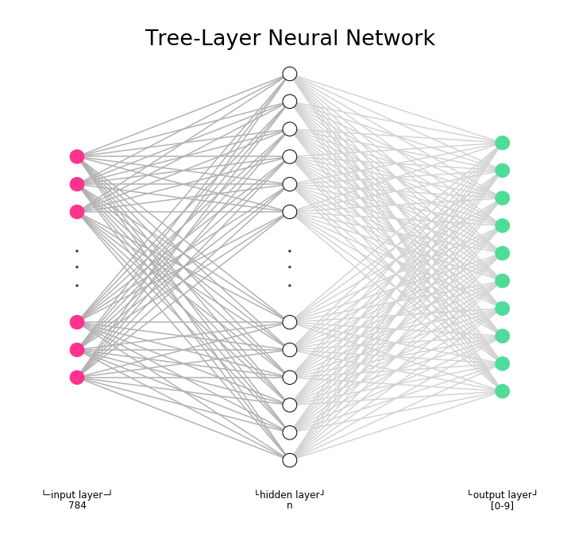

# Building a Hand Written Digits Recognition Neural Network from scratch

For this project I decided to build a three-layer (one-hidden layer) Artificial Neural Network (ANN) which classifies handwritten digits.  Nowadays, the existence of various machine learning libraries like TensorFlow, Keras, and others greatly simplifies this process, although my aim was to understand how the NN can be built from scratch, to get the exposure to the various factors responsible for the ANN’s performance, and to explore the difference between such factors with the help of visualization. 

The following list was used as a guide to the project:

1. Get the data;
2. Explore the data;
3. Preprocess the data;
4. Build the model:
    - set up the architecture (the layers),
    - decide on hyper-parameters,
    - choose the cost and activation functions;
4. Train the model;
5. Evaluate accuracy;
6. Make predictions;
7. Test.

The data for my NN was taken from the MNIST database. 
The MNIST-digit data is a collection of the labeled hand-written digits. It consists of 60,000 gray-scale images allocated for NN training and of 10,000 used for testing the model. Each image is a 28x28 pixel matrix, which makes it convenient to represent the input neurons as 784-dimensional vectors.  Here, the training data was further divided into 50,000 training images and 10,000 images used as validation data. 
()

 *Note: the reduced data set from sklearn is represented by a (1797, 8, 8) tuple.
 
 It is very important to understand the data you working with, which took me quite awhile. Even after getting familiar with the structure of your data, after seeing how it should be transformed so you are able use it for your NN, I learned eventually that one never should assume that everything is the way one thinks it is. I came to conclusion that visualization of a few random images from the set (e.g.) before the training starts is a must — that would help to avoid some dead-ends or confusions and, most importantly, save time (more on that below). 
 
As I mentioned above, the input layer was represented by a 784-dimensional vector, with each vector’s value representing the saturation of each pixel in an image. The output layer was represented with 10 neurons (10 classes), each classifying one of 10 ten digits (0-9).  The hidden layer situation was not as clear, but for simplicity of representation, my NN with a 15-neurons hidden layer could be depicted as follows:

